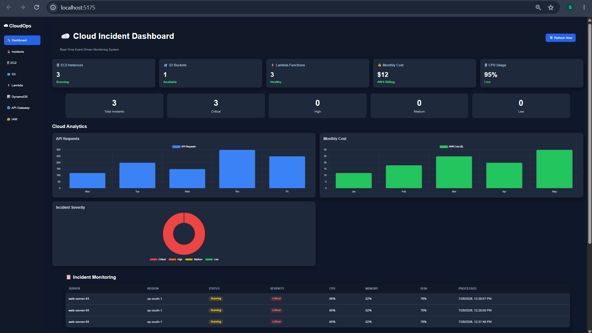
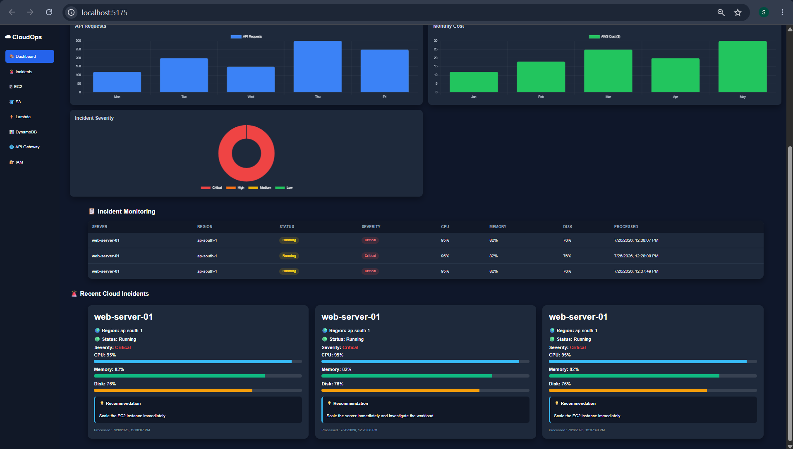
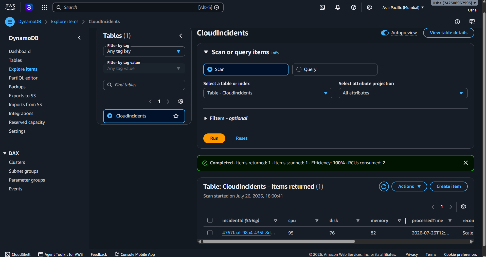
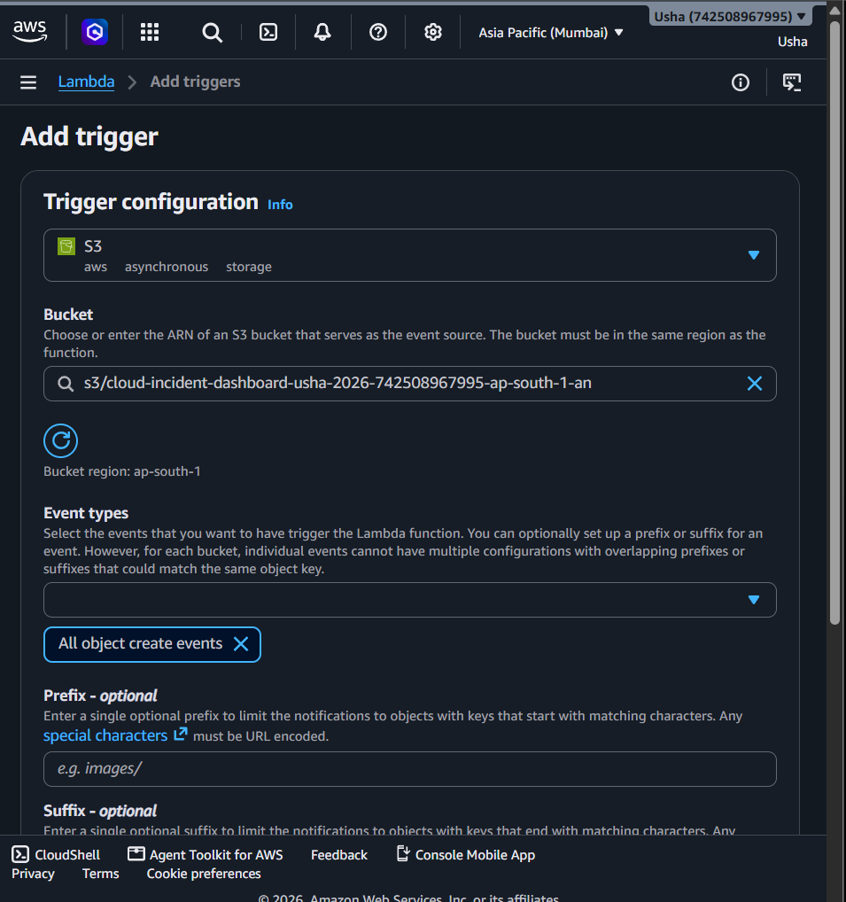
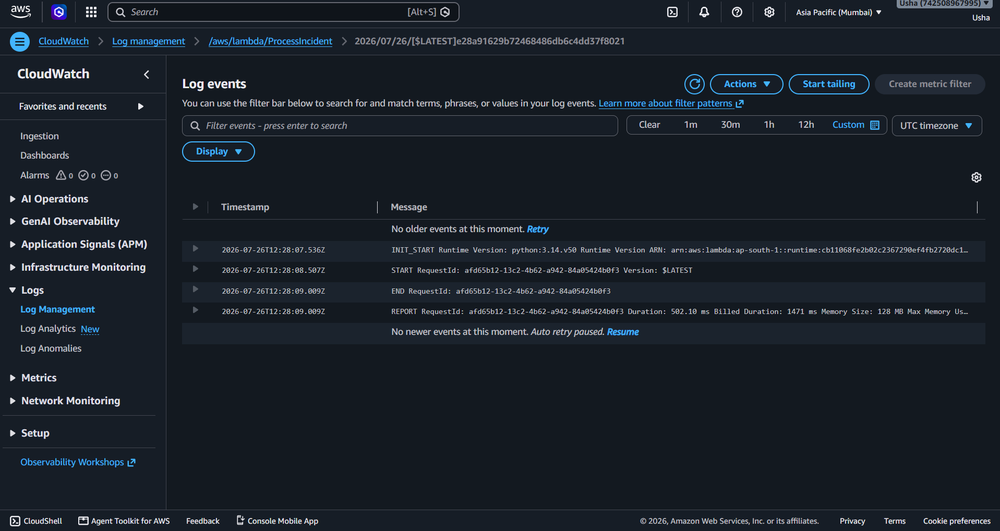
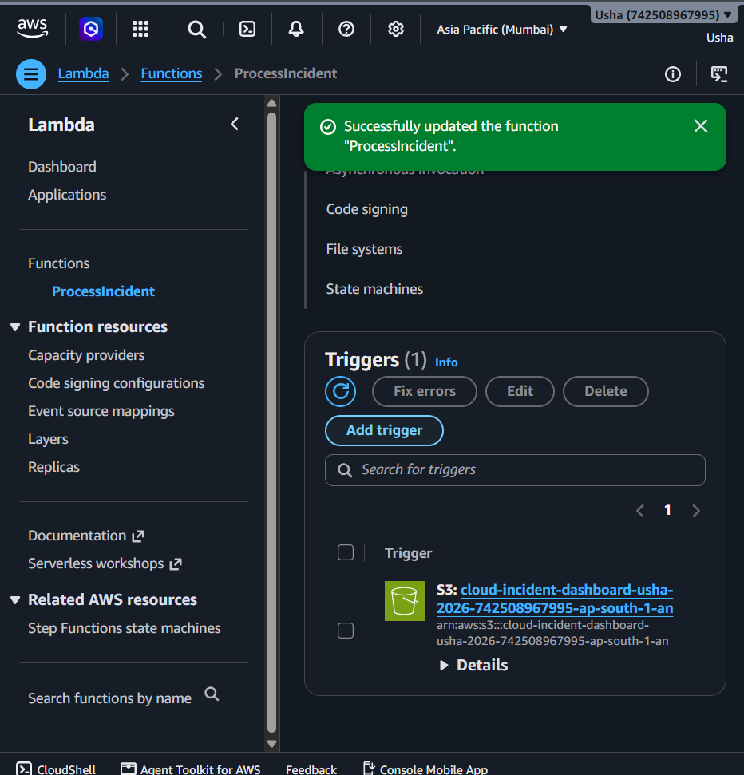
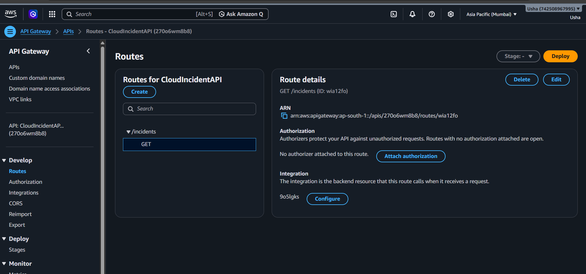
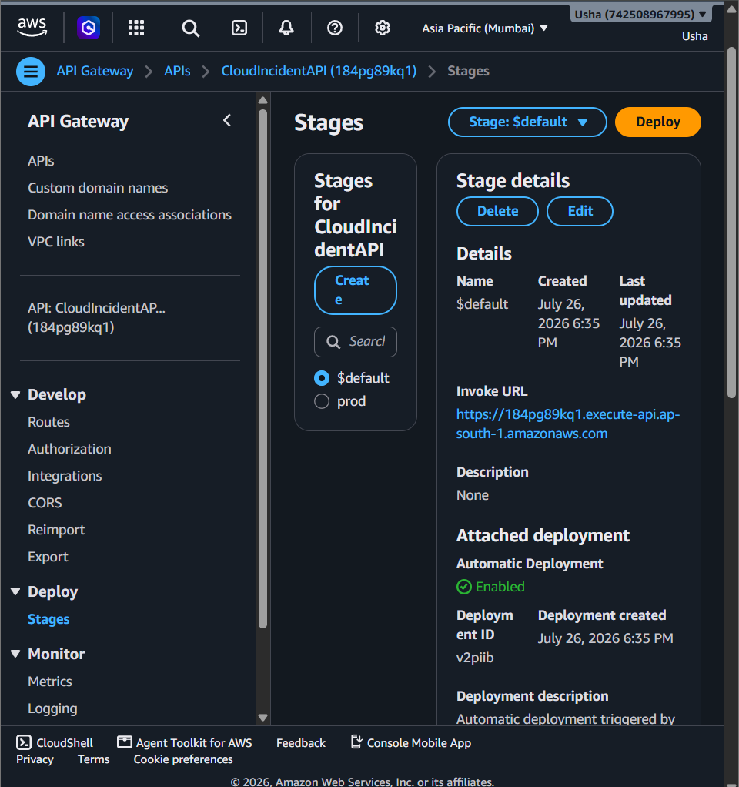

# ☁️ Cloud Incident Monitoring Dashboard

A real-time Cloud Incident Monitoring Dashboard built using **TypeScript, Vite, Chart.js, and AWS services**. The dashboard provides centralized monitoring of cloud infrastructure, tracks incidents, visualizes performance metrics, and displays actionable recommendations for faster issue resolution.

---


## 📌 Project Overview

This dashboard simulates a cloud monitoring solution that enables users to monitor cloud infrastructure health in real time.

It provides insights into:

- 🖥️ EC2 Instances
- 🪣 Amazon S3 Buckets
- ⚡ AWS Lambda Functions
- 💰 Monthly AWS Cost
- 📈 CPU Usage
- 🚨 Incident Severity Summary
- 📊 API Request Analytics
- 📉 Monthly Cost Analytics
- 📋 Recent Cloud Incidents
- ❤️ Server Health Metrics
- 💡 Incident Recommendations

---
# 📄 Project Documentation

The project documentation and diagrams are available in the `documentation` folder.

- 📘 Documentation.pdf
- 🏗️ Architecture-Diagram.png
- 🔄 Workflow-Diagram.png

# ✨ Features

### ☁️ Cloud Infrastructure Overview

Monitor important AWS resources including:

- EC2 Instances
- S3 Buckets
- Lambda Functions
- Monthly AWS Cost
- CPU Utilization

---

### 🚨 Incident Monitoring

Each incident includes:

- Server Name
- AWS Region
- Current Status
- Incident Severity
- CPU Utilization
- Memory Utilization
- Disk Utilization
- Recommended Action
- Processed Timestamp

---

### 📊 Analytics Dashboard

Interactive charts provide insights into:

- API Request Trends
- Monthly AWS Cost
- Incident Severity Distribution
- Resource Utilization

---

### 🔄 Real-Time Monitoring

- Automatic refresh every **30 seconds**
- Manual **Refresh Now** button
- Live cloud incident updates

---

# 🛠️ Tech Stack

### Frontend

- TypeScript
- HTML5
- CSS3
- Vite
- Chart.js

### AWS Services

- Amazon API Gateway
- AWS Lambda
- Amazon DynamoDB
- Amazon S3
- Amazon CloudWatch
- AWS IAM

---
## 📂 Project Structure

```text
cloud-dashboard/
│
├── 📁 backend/                     # Backend services and APIs
│
├── 📁 documentation/               # Project documentation
│   ├── 📄 Architecture-Diagram.png
│   ├── 📄 Workflow-Diagram.png
│   └── 📄 Documentation.pdf
│
├── 📁 public/                      # Static assets
│
├── 📁 screenshots/                 # Project screenshots
│   ├── 📸 01-final-dashboard.png
│   ├── 📸 01-final-dashboard2.png
│   ├── 📸 02-dynamodb-processed-data.png
│   ├── 📸 03-trigger.png
│   ├── 📸 04-iam-roles.png
│   ├── 📸 05-s3-bucket-upload-status.png
│   ├── 📸 06-cloudwatch.png
│   ├── 📸 07-lambda-function.png
│   ├── 📸 08-api-gateway.png
│   └── 📸 09-api-stage.png
│
├── 📁 src/
│   ├── 📁 components/
│   │   ├── 📄 AnalyticsChart.ts
│   │   ├── 📄 Charts.ts
│   │   ├── 📄 CloudCard.ts
│   │   ├── 📄 CPUChart.ts
│   │   ├── 📄 MemoryChart.ts
│   │   ├── 📄 Monitoring.ts
│   │   ├── 📄 Navbar.ts
│   │   ├── 📄 Sidebar.ts
│   │   └── 📄 Summary.ts
│   │
│   ├── 📁 services/
│   │   ├── 📄 api.ts
│   │   └── 📄 cloudData.ts
│   │
│   ├── 📄 main.ts
│   └── 📄 style.css
│
├── 📄 .gitignore
├── 📄 index.html
├── 📄 package.json
├── 📄 package-lock.json
└── 📄 README.md
```

---

# 🚀 Installation

Clone the repository

```bash
git clone https://github.com/your-username/cloud-incident-dashboard.git
```

Go to the project directory

```bash
cd cloud-incident-dashboard
```

Install dependencies

```bash
npm install
```

Run the project

```bash
npm run dev
```

Build for production

```bash
npm run build
```

---

# 📸 Project Screenshots

## Dashboard



---

## Dashboard Overview



---

## DynamoDB Processed Data



---

## Lambda Trigger



---

## IAM Roles


---

## S3 Upload Status


---

## Amazon CloudWatch



---

## AWS Lambda Function



---

## API Gateway



---

## API Stage



---

# 🎯 Key Highlights

- Real-time cloud monitoring dashboard
- AWS service integration
- Interactive data visualization
- Automated incident tracking
- Resource utilization monitoring
- Cloud cost analytics
- Responsive dashboard interface
- Modular TypeScript architecture

---

# 📈 Future Improvements

- User Authentication
- Role-Based Access Control (RBAC)
- Email/SMS Incident Alerts
- Multi-Cloud Monitoring
- Historical Incident Reports
- Export Reports (PDF & Excel)
- Dark Mode
- AI-based Incident Prediction

---

# 👩‍💻 Author

**Usha**

Final Year B.Tech CSE Student

---

## ⭐ If you found this project useful, consider giving it a Star!
